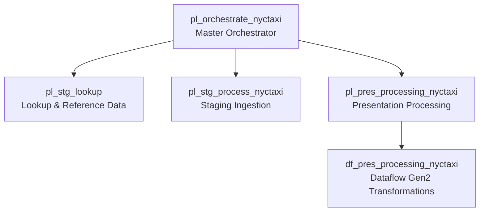
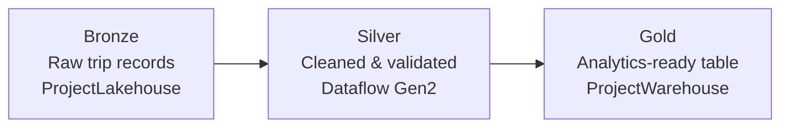

# End-to-End NYC Taxi Analytics Platform using Microsoft Fabric

**A production-inspired analytics engineering solution — from raw data ingestion to executive dashboards, built entirely on Microsoft Fabric.**


---

## Business Scenario

A city transportation authority needs reliable, self-service analytics on taxi operations: revenue trends, vendor performance, payment behavior, and demand patterns across boroughs. Analysts were previously working from raw CSV extracts — slow, error-prone, and impossible to govern.

This project addresses that with a governed, automated pipeline: raw NYC Yellow Taxi trip records are ingested, cleansed, and landed in an analytics-ready warehouse that feeds an interactive Power BI report. The whole refresh runs through orchestrated Fabric pipelines.

**At a glance:** orchestrated pipelines → Lakehouse (Bronze) → Dataflow Gen2 (Silver) → SQL Warehouse (Gold) → semantic model → Power BI. Medallion architecture, single Fabric workspace, no external tooling.

---

## Solution Architecture


*End-to-end flow within Microsoft Fabric (OneLake): orchestrated pipelines ingest raw trip data into the Bronze Lakehouse, Dataflow Gen2 curates it through Silver, and the Gold SQL Warehouse feeds the `nyctaxi_yellow` semantic model behind the NYC Yellow Taxi Report.*

### Why this design?

| Decision | Rationale |
|---|---|
| **Modular child pipelines** | Single-responsibility pipelines are independently testable, reusable, and easier to debug than one monolith |
| **Medallion architecture** | Clear contract between raw, cleaned, and business-ready data; supports reprocessing without re-ingestion |
| **SQL Warehouse for Gold** | T-SQL analytics surface familiar to BI teams; analytics-ready serving layer for the semantic model |
| **Semantic Model layer** | Centralizes business logic (measures, relationships) so every report shares one source of truth |

---

## Pipeline Orchestration

Ingestion and processing is coordinated by a **master orchestration pipeline** that executes modular child pipelines in sequence:



| Pipeline | Responsibility |
|---|---|
| `pl_orchestrate_nyctaxi` | Master pipeline — coordinates execution order, dependencies, and failure handling |
| `pl_stg_lookup` | Loads lookup/reference data (vendors, payment types, borough zones) |
| `pl_stg_process_nyctaxi` | Ingests raw trip records into the Lakehouse staging layer |
| `pl_pres_processing_nyctaxi` | Promotes cleaned data into the presentation layer |
| `df_pres_processing_nyctaxi` | Dataflow Gen2 — data cleansing, type enforcement, business-rule transformations |

**Design principle:** each pipeline owns exactly one responsibility. This improves maintainability (isolated changes), reusability (lookup pipeline serves future datasets), and scalability (parallelizable stages).

---

## Medallion Architecture



| Layer | Store | Purpose |
|---|---|---|
| **Bronze** | `ProjectLakehouse` | Immutable raw source data — preserves full fidelity for auditing and reprocessing |
| **Silver** | Dataflow Gen2 output | Standardized types, null handling, deduplication, validated records |
| **Gold** | `ProjectWarehouse` | Analytics-ready table (`dbo.nyctaxi_yellow`) optimized for reporting |

---

## Semantic Model & Dashboard

The **`nyctaxi_yellow`** semantic model sits between the warehouse and reporting layer, providing:

- **Single analytics-ready table** — lookups (vendor, borough, payment) resolved upstream in Dataflow Gen2
- **Reusable DAX measures** — revenue, trips, passengers, per-trip averages
- **Business-friendly naming** so analysts self-serve without knowing table internals

> **Note:** the semantic model was published through Power BI due to Fabric Trial capacity limitations. The modeling approach is identical to a Fabric-native deployment.

### Dashboard Coverage

The Power BI report answers the questions operators actually ask:

| Business Question | Dashboard View |
|---|---|
| Which vendor generates the highest revenue? | Vendor Analysis |
| What payment method dominates? | Payment Analysis |
| When are peak travel hours? | Time Analysis |
| Which borough has the highest trip volume? | Location Analysis |
| How many passengers travel daily? | Trips & Passenger KPIs |

*(Screenshots: [`assets/screenshots/`](assets/screenshots/))*

---

## Dataset

**NYC Yellow Taxi Trip Records** — millions of trip-level records including:

`Pickup/Dropoff Timestamps` · `Vendor` · `Passenger Count` · `Trip Distance` · `Fare Amount` · `Tip Amount` · `Payment Method` · `Pickup/Dropoff Borough`

---

## Technology Stack

| Layer | Technology |
|---|---|
| Platform | Microsoft Fabric (OneLake) |
| Orchestration | Fabric Data Pipelines |
| Transformation | Dataflow Gen2 |
| Storage | Lakehouse (Bronze/Silver), SQL Warehouse (Gold) |
| Modeling | Semantic Model (DAX) |
| Reporting | Power BI |
| Version Control | Git / GitHub |

---

## Documentation

| Document | What it covers |
|---|---|
| [Pipeline Architecture](docs/pipeline-architecture.md) | Orchestration design, pipeline catalog, failure & rerun strategy, design principles |
| [Semantic Model](docs/semantic-model.md) | Single-table model design, DAX measures, modeling trade-offs |
| [Data Dictionary](docs/data-dictionary.md) | Column-level definitions, lineage, and data quality notes for the warehouse table |
| [Analytical Queries](sql/analytical-queries.sql) | T-SQL queries answering each business question against the warehouse |

---

## Repository Structure

```
microsoft-fabric-nyc-taxi-analytics/
├── README.md
├── assets/
│   ├── diagrams/                    # Architecture & orchestration diagrams
│   └── screenshots/                 # Fabric workspace, pipelines, dashboard
├── docs/
│   ├── pipeline-architecture.md     # Orchestration deep-dive
│   ├── semantic-model.md            # Model design & DAX measures
│   └── data-dictionary.md           # Column definitions & lineage
├── sql/
│   └── analytical-queries.sql       # Business-question queries
├── powerbi/                         # Report file / model documentation
├── sample-data/                     # Small representative data samples
├── LICENSE
└── .gitignore
```

---

## Challenges & Engineering Decisions

- **Large dataset volumes** — handled via staged ingestion into the Lakehouse before transformation, rather than transforming in-flight
- **Data quality** — Dataflow Gen2 enforces type safety, null handling, and validation before data reaches the warehouse
- **Orchestration complexity** — solved with a master/child pipeline pattern instead of a single monolithic pipeline
- **Fabric Trial limitations** — worked around semantic model publishing constraints via Power BI while preserving the intended architecture

---

## Skills Demonstrated

**Analytics Engineering** · **Data Engineering** · **Microsoft Fabric** · **Pipeline Orchestration** · **Medallion Architecture** · **Data Warehousing** · **Data Modeling** · **Semantic Modeling (DAX)** · **SQL** · **Power BI** · **Technical Documentation**

---

## Roadmap

- [ ] Evolve the Gold layer to a dimensional star schema as additional fact tables (e.g., green taxi) are onboarded
- [ ] Incremental refresh for large-scale ingestion
- [ ] Parameterized pipelines for multi-dataset reuse
- [ ] Deployment pipelines & CI/CD (Dev → Test → Prod)
- [ ] Scheduled/triggered pipeline execution
- [ ] Data quality monitoring & alerting
- [ ] Real-time streaming ingestion (Eventstream)

---

## Author

**Erwin Glenn Capitan II**
Analytics Engineer · Business Intelligence Analyst · Data Engineer

*This project demonstrates the complete analytics lifecycle — ingestion, orchestration, transformation, warehousing, semantic modeling, and reporting — within a single governed platform.*
