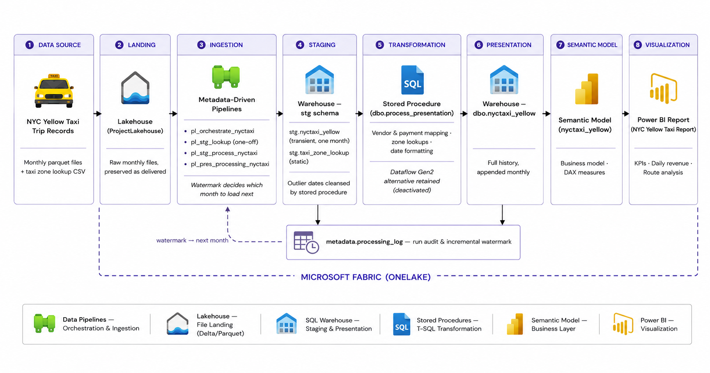
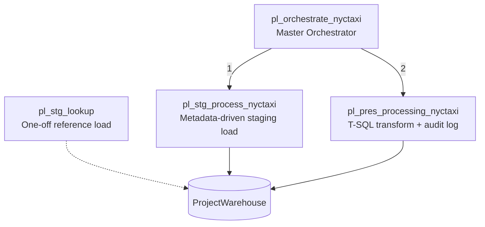
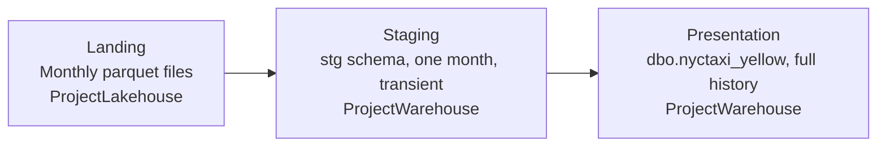
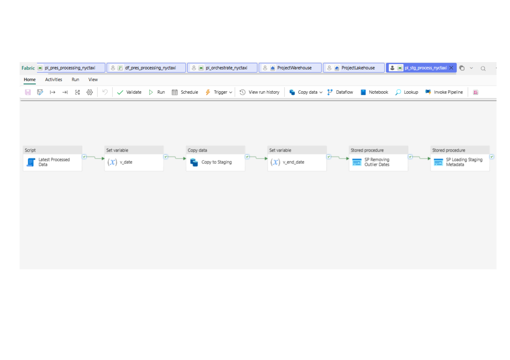
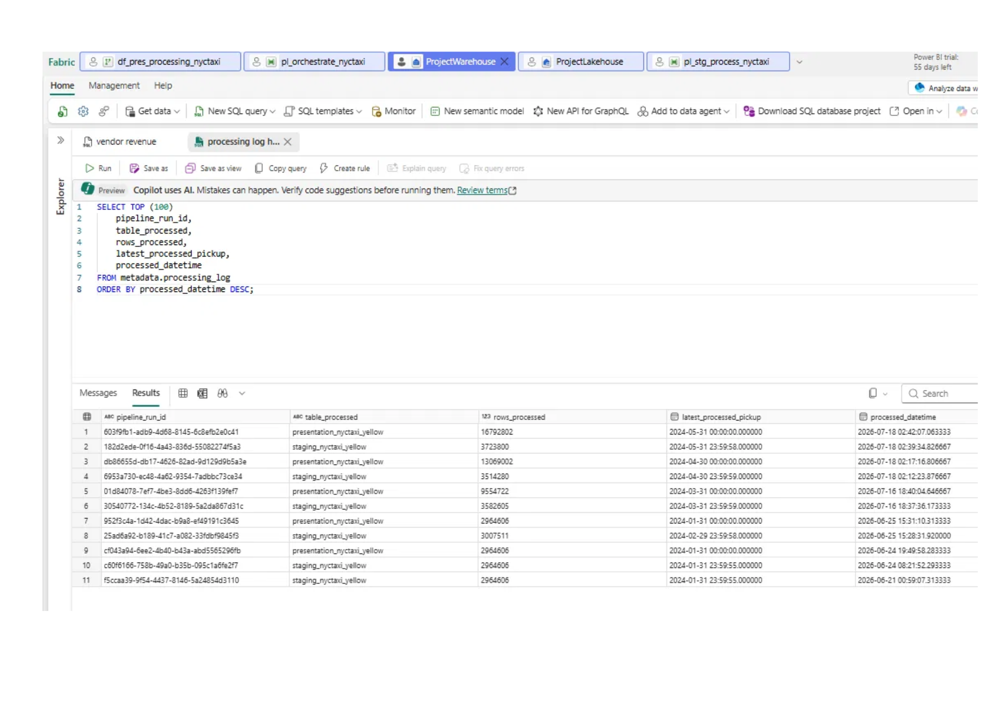
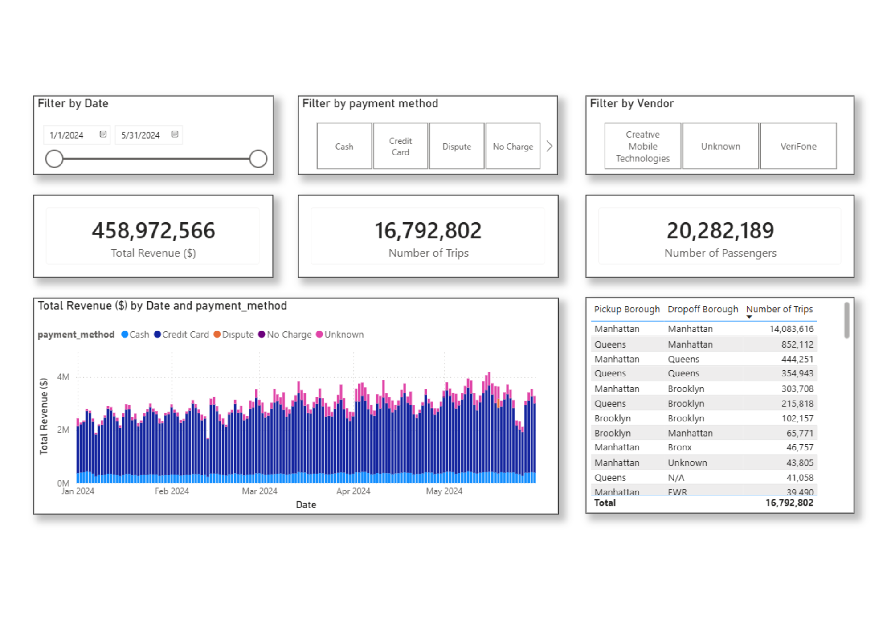

# End-to-End NYC Taxi Analytics Platform using Microsoft Fabric

**A production-inspired analytics engineering solution — from raw data ingestion to executive dashboards, built entirely on Microsoft Fabric.**


---

## Business Scenario

A city transportation authority needs reliable, self-service analytics on taxi operations: revenue trends, vendor performance, payment behavior, and demand patterns across boroughs. Analysts were previously working from raw CSV extracts — slow, error-prone, and impossible to govern.

This project addresses that with a governed, automated pipeline: raw NYC Yellow Taxi trip records are ingested, cleansed, and landed in an analytics-ready warehouse that feeds an interactive Power BI report. The whole refresh runs through orchestrated Fabric pipelines.

**At a glance:** parquet files land in a Lakehouse → metadata-driven pipelines load a warehouse staging schema one month at a time → T-SQL stored procedures transform and append to a historical presentation table → semantic model → Power BI. Incremental, auditable, built entirely within Microsoft Fabric.

---

## Solution Architecture



*End-to-end flow within Microsoft Fabric (OneLake): monthly parquet files land in the Lakehouse, orchestrated pipelines copy them into the Warehouse staging schema, T-SQL stored procedures cleanse and transform into the presentation table, which feeds the `nyctaxi_yellow` semantic model behind the NYC Yellow Taxi Report.*

### Why this design?

| Decision | Rationale |
|---|---|
| **Metadata-driven incremental loading** | A `processing_log` watermark tells each run which month to load next — no manual parameters, no double-processing |
| **Transient staging, historical presentation** | Staging is deleted and reloaded per month; the presentation table appends full history — clear contract between layers |
| **Stored procedure over Dataflow Gen2** | The transformation was built both ways; the T-SQL version cut presentation processing from ~2–3 minutes to ~30 seconds |
| **Semantic Model layer** | Centralizes business logic and naming so every report shares one source of truth |

---

## Pipeline Orchestration

Ingestion and processing is coordinated by a **master orchestration pipeline** that executes modular child pipelines in sequence:



| Pipeline | Responsibility |
|---|---|
| `pl_orchestrate_nyctaxi` | Master pipeline — invokes staging then presentation; the single entry point for a refresh |
| `pl_stg_lookup` | One-off load of the static taxi zone lookup into `stg.taxi_zone_lookup` |
| `pl_stg_process_nyctaxi` | Reads the watermark from `metadata.processing_log`, derives the next month, copies that parquet file from the Lakehouse into warehouse staging, cleanses outlier dates, logs the run |
| `pl_pres_processing_nyctaxi` | Runs `dbo.process_presentation` (T-SQL transform, staging → presentation, append) and logs the run. A Dataflow Gen2 alternative is retained deactivated |

The staging pipeline is fully self-managing: each run derives which month to process from the metadata log, so no parameters need editing between runs. See [Pipeline Architecture](docs/pipeline-architecture.md) for the activity-level flow, and the Dataflow-vs-stored-procedure performance comparison.

---

## Layered Design



| Layer | Store | Purpose |
|---|---|---|
| **Landing** | `ProjectLakehouse` (Files) | Raw monthly parquet files and the zone lookup CSV, preserved as delivered |
| **Staging** | `ProjectWarehouse`, `stg` schema | One month of trip data, deleted and reloaded each run; outlier dates cleansed by stored procedure |
| **Presentation** | `ProjectWarehouse`, `dbo.nyctaxi_yellow` | Analytics-ready table with full history; each month appended |

A deliberate simplification: cleansed data goes directly from staging to presentation without an intermediate persisted layer — the transformation happens in transit via stored procedure. The `metadata.processing_log` table provides the run-to-run control that a medallion-style intermediate layer would otherwise help manage.


---

## Semantic Model & Dashboard

The **`nyctaxi_yellow`** semantic model sits between the warehouse and reporting layer, providing:

- **Single analytics-ready table** — vendor, payment, and location lookups resolved upstream in the T-SQL transformation
- **Reusable DAX measures** — revenue, trips, passengers, per-trip averages
- **Business-friendly naming** so analysts self-serve without knowing table internals

> **Note:** due to My workspace / trial publishing limitations, the semantic model lives in a dedicated reporting workspace and sources a snapshot of `ProjectWarehouse`. The modeling approach is identical to binding directly against the primary warehouse — see [Semantic Model](docs/semantic-model.md) for details.

### Dashboard Coverage

The Power BI report answers the questions operators actually ask:

| Business Question | Dashboard View |
|---|---|
| Which vendor generates the highest revenue? | Vendor Analysis |
| What payment method dominates? | Payment Analysis |
| How is revenue trending day to day? | Daily Revenue by Payment Method |
| What are the most frequent pickup → dropoff routes? | Borough Journeys Table |
| How many passengers travel daily? | Trips & Passenger KPIs |

*(Screenshots: [`assets/screenshots/`](assets/screenshots/))*

---

## Dataset

**NYC Yellow Taxi Trip Records** — millions of trip-level records including:

`Pickup/Dropoff Timestamps` · `Vendor` · `Passenger Count` · `Trip Distance` · `Fare Amount` · `Tip Amount` · `Payment Method` · `Pickup/Dropoff Borough`

---

## Technology Stack

| Layer | Technology |
|---|---|
| Platform | Microsoft Fabric (OneLake) |
| Orchestration | Fabric Data Pipelines |
| Transformation | T-SQL Stored Procedures (Dataflow Gen2 alternative retained) |
| Storage | Lakehouse (file landing), SQL Warehouse (staging + presentation) |
| Modeling | Semantic Model (DAX) |
| Reporting | Power BI |
| Version Control | Git / GitHub |

---

## Platform Walkthrough

**The metadata-driven staging pipeline** — a script activity reads the watermark from `metadata.processing_log`, derives the next month, copies that file from the Lakehouse, cleanses outlier dates, and logs the run:



**The run history** — one incremental load per month, watermarks advancing, the presentation table accumulating full history:



**The report** — KPIs, daily revenue by payment method, and the most frequent borough-to-borough journeys:



All fourteen captures — workspace, Lakehouse, each pipeline (including the reporting-warehouse sync pipeline), the Dataflow, warehouse schemas, semantic model, and both lineage views — are in [`assets/screenshots/`](assets/screenshots/).

---

## Documentation

| Document | What it covers |
|---|---|
| [Pipeline Architecture](docs/pipeline-architecture.md) | Orchestration, metadata-driven incremental loading, Dataflow-vs-SP decision, failure & rerun strategy |
| [Semantic Model](docs/semantic-model.md) | Single-table model design, DAX measures, modeling trade-offs |
| [Data Dictionary](docs/data-dictionary.md) | Column-level definitions, lineage, and data quality notes for the warehouse table |
| [Analytical Queries](sql/analytical-queries.sql) | T-SQL queries answering each business question against the warehouse |

---

## Repository Structure

```
microsoft-fabric-nyc-taxi-analytics/
├── README.md
├── assets/
│   ├── diagrams/                    # Architecture & orchestration diagrams
│   └── screenshots/                 # 14 captures — workspace, pipelines, warehouse, model, report
├── docs/
│   ├── pipeline-architecture.md     # Orchestration deep-dive
│   ├── semantic-model.md            # Model design & DAX measures
│   └── data-dictionary.md           # Column definitions & lineage
├── sql/
│   └── analytical-queries.sql       # Business-question queries
├── LICENSE
└── .gitignore
```

---

## Challenges & Engineering Decisions

- **Large dataset volumes** — handled via staged ingestion into the Lakehouse before transformation, rather than transforming in-flight
- **Data quality** — Dataflow Gen2 enforces type safety, null handling, and validation before data reaches the warehouse
- **Orchestration complexity** — solved with a master/child pipeline pattern instead of a single monolithic pipeline
- **Workspace publishing limitations** — Fabric's My workspace (trial) restricts semantic model publishing, so the reporting layer (warehouse snapshot → semantic model → report) was stood up in a dedicated reporting workspace — accidentally arriving at the common enterprise pattern of separate data and reporting workspaces

---

## Skills Demonstrated

**Analytics Engineering** · **Data Engineering** · **Microsoft Fabric** · **Pipeline Orchestration** · **Incremental Loading** · **Data Warehousing** · **Data Modeling** · **Semantic Modeling (DAX)** · **SQL** · **Power BI** · **Technical Documentation**

---

## Roadmap

- [ ] Evolve the presentation layer to a dimensional star schema as additional fact tables (e.g., green taxi) are onboarded
- [ ] Parameterized pipelines for multi-dataset reuse
- [ ] Deployment pipelines & CI/CD (Dev → Test → Prod)
- [ ] Scheduled/triggered pipeline execution
- [ ] Data quality monitoring & alerting
- [ ] Real-time streaming ingestion (Eventstream)

---

## Author

**Erwin Glenn Capitan II**
Analytics Engineer · Business Intelligence Analyst · Data Engineer

*This project demonstrates the complete analytics lifecycle — ingestion, orchestration, transformation, warehousing, semantic modeling, and reporting — within a single governed platform.*

---

## Acknowledgments

The initial implementation follows a public NYC Taxi / Microsoft Fabric walkthrough. The verification against the live workspace, documentation set, data dictionary, SQL analysis, and extensions are my own work.
