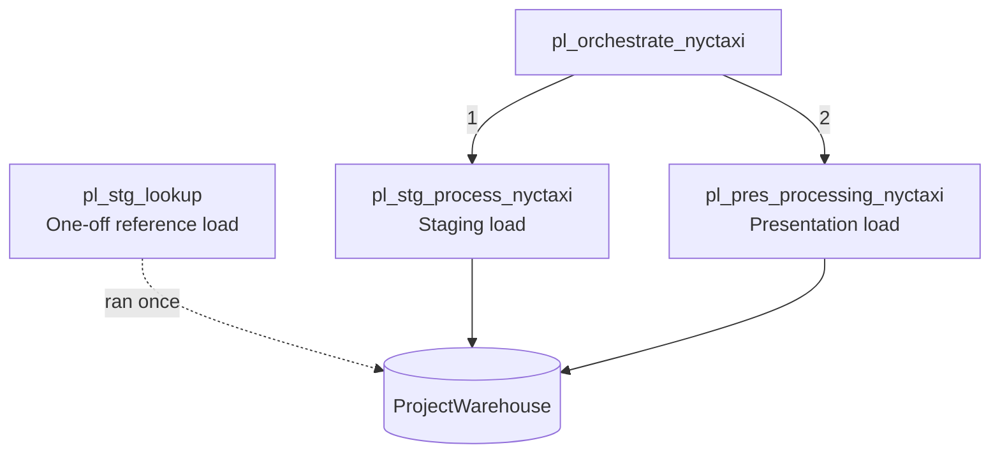
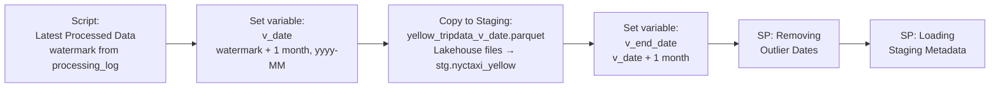

# Pipeline Architecture

This document describes the orchestration design, execution flow, and the metadata framework that makes the pipeline incremental and idempotent.

---

## Orchestration Overview

The end-to-end refresh is coordinated by a master orchestration pipeline that invokes the staging and presentation pipelines in sequence. The lookup pipeline is a one-off load and is not part of the recurring run.

| Pipeline | Role | Cadence |
|---|---|---|
| `pl_orchestrate_nyctaxi` | Invokes staging then presentation; single entry point for a refresh | Per run (schedulable monthly) |
| `pl_stg_lookup` | Copies the taxi zone lookup CSV from the Lakehouse into `stg.taxi_zone_lookup` | One-off; table is static |
| `pl_stg_process_nyctaxi` | Loads one month of raw trip data into warehouse staging | Per run |
| `pl_pres_processing_nyctaxi` | Transforms staging into the presentation table and logs the run | Per run |

---

## Staging Pipeline — Metadata-Driven Incremental Load

`pl_stg_process_nyctaxi` is fully dynamic: it works out for itself which month to load next. No parameter needs to be edited between runs.

Step by step:

1. **Watermark lookup (Script activity).** Queries `metadata.processing_log` for the latest `latest_processed_pickup` where `table_processed = 'staging_nyctaxi_yellow'` (`SELECT TOP 1 ... ORDER BY latest_processed_pickup DESC` — the script activity supports a limited function set, so `TOP 1`/`ORDER BY` stands in for `MAX`).
2. **Next-month derivation (Set variable).** The pipeline extracts the watermark from the script's JSON output (`resultSets[0].rows[0].latest_processed_pickup`), adds one month with `addToTime`, and formats it as `yyyy-MM` into the `v_date` variable.
3. **Copy to staging.** The source file path is built dynamically — `concat('yellow_tripdata_', variables('v_date'), '.parquet')` — reading from the Lakehouse `nyc_taxi_yellow` files folder into `stg.nyctaxi_yellow`. A pre-copy script deletes the staging table's contents first (`DELETE FROM`, as Fabric Warehouse does not yet support `TRUNCATE`), so staging always holds exactly one month.
4. **Cleansing window derivation (Set variable).** A second variable, `v_end_date`, is computed as `v_date` plus one month (`addToTime`), giving the exclusive upper bound of the month being processed.
5. **Outlier-date cleansing (Stored procedure).** The raw files contain stray records outside the target month (dates as far back as 2002 were observed in the January file). A parameterized procedure deletes rows where `tpep_pickup_datetime` falls outside the `v_date`–`v_end_date` window.
6. **Audit logging (Stored procedure).** `metadata.insert_staging_metadata` records the pipeline run ID (system variable), table name, row count, the new watermark (`MAX(tpep_pickup_datetime)`), and the trigger time.

---

## Presentation Pipeline — T-SQL Transformation

`pl_pres_processing_nyctaxi` promotes staged data to the presentation table `dbo.nyctaxi_yellow`, then logs the run.

**Active path:** the stored procedure `dbo.process_presentation` performs the transformation in set-based T-SQL — vendor ID and payment-type codes mapped to business labels via `CASE`, pickup/dropoff timestamps formatted to dates, and two `LEFT JOIN`s to `stg.taxi_zone_lookup` resolving pickup and dropoff location IDs to borough and zone. Output is appended, so the presentation table keeps full history while staging stays transient.

**Alternative path (deactivated, retained in the pipeline):** a Dataflow Gen2 (`df_pres_processing_nyctaxi`) implementing the identical transformation in Power Query. The solution was first built with the Dataflow, then re-implemented as a stored procedure — presentation processing time dropped from roughly 2–3 minutes to around 30 seconds, since Dataflows carry engine start-up and staging overheads that set-based SQL avoids. The Dataflow is kept deactivated as a documented alternative implementation.

Both paths converge on `metadata.insert_presentation_metadata`, which logs the run against the presentation table.

---

## Metadata Framework

The `metadata.processing_log` table is what turns a collection of pipelines into a self-managing process:

| Column | Purpose |
|---|---|
| `pipeline_run_id` | Fabric system variable; traces any row back to the exact run in the Monitor hub |
| `table_processed` | Which layer the entry describes (staging or presentation) |
| `rows_processed` | Row count at load time — staging shows per-month volume, presentation shows cumulative history |
| `latest_processed_pickup` | The watermark driving incremental loading |
| `processed_datetime` | Pipeline trigger time |

What this buys the platform:

- **Incremental loading** — each run derives the next month from the watermark; no manual parameter edits
- **Idempotency guardrails** — staging is deleted before load and the watermark advances only on success, so the same month isn't double-appended by a normal rerun
- **Auditability** — every load is traceable to a pipeline run ID, row count, and timestamp

---

## Failure & Rerun Strategy

| Failure point | Recovery |
|---|---|
| Copy to staging fails | Rerun the orchestrator — watermark hasn't advanced, so the same month is retried; staging delete-first makes the retry clean |
| Cleansing or staging metadata SP fails | Rerun staging pipeline; presentation hasn't run, presentation table untouched |
| Presentation SP fails | Rerun presentation pipeline only — staging data is intact, no re-ingestion needed |
| Run succeeds but data looks wrong | `processing_log` gives row counts and watermarks per run to localize which load diverged |

---

## Design Principles

1. **Metadata-driven, not parameter-driven** — the pipeline decides what to process next from its own log
2. **Transient staging, historical presentation** — staging holds one month and is deleted each run; presentation appends full history
3. **Set-based SQL for heavy transformation** — measured as roughly 4–5× faster than the equivalent Dataflow for this workload
4. **Single entry point** — one orchestrator to run, schedule, and monitor
