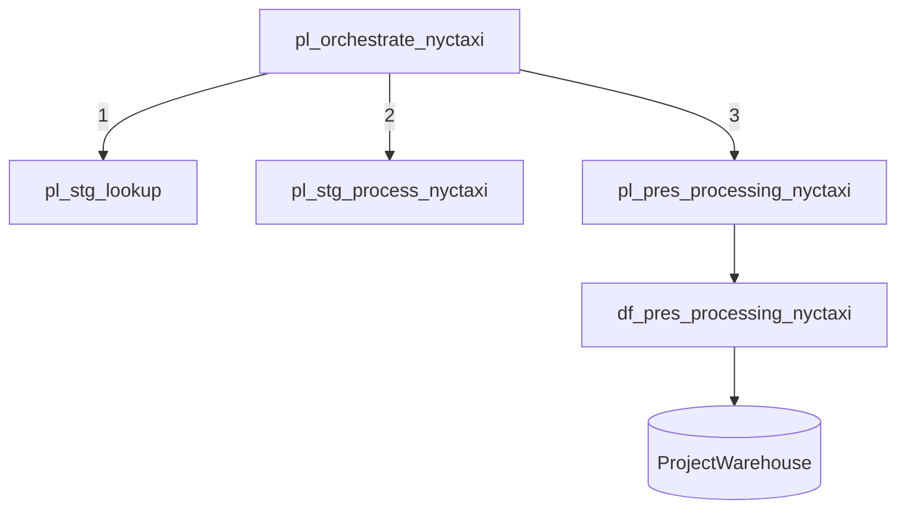

# Pipeline Architecture

This document describes the orchestration design, execution flow, and design principles behind the platform's ETL pipelines.

---

## Orchestration Overview

All data movement is coordinated by a single **master orchestration pipeline**, which invokes modular child pipelines in dependency order. No child pipeline is scheduled independently — the orchestrator is the single entry point for the platform's refresh cycle.

---

## Pipeline Catalog

### `pl_orchestrate_nyctaxi` — Master Orchestrator

**Responsibility:** Coordinate the end-to-end refresh.

- Invokes child pipelines via Execute Pipeline activities
- Enforces execution order: lookups → staging → presentation
- Centralizes failure handling — a failed stage halts downstream execution, preventing partial or inconsistent loads

**Why a master/child pattern?** A monolithic pipeline mixes concerns and forces full reruns on any failure. With modular children, a failed presentation load can be re-run without re-ingesting raw data.

---

### `pl_stg_lookup` — Reference Data Ingestion

**Responsibility:** Load lookup/reference tables into the Lakehouse.

- Loads dimension source data: vendors, payment types, taxi zone/borough mappings
- Runs first so that downstream joins always resolve against current reference data
- Reusable: future datasets requiring the same reference data can invoke this pipeline without duplication

---

### `pl_stg_process_nyctaxi` — Staging Ingestion (Bronze)

**Responsibility:** Ingest raw NYC Yellow Taxi trip records into `ProjectLakehouse`.

- Copies source data as-is — no transformation at this stage
- Preserves full source fidelity for auditability and reprocessing
- Bronze data is treated as immutable: corrections happen downstream, never by mutating raw records

---

### `pl_pres_processing_nyctaxi` — Presentation Processing (Silver → Gold)

**Responsibility:** Promote cleaned, validated data toward the analytics layer.

- Triggers `df_pres_processing_nyctaxi` (Dataflow Gen2) for transformation logic
- Lands analytics-ready output in `ProjectWarehouse`

---

### `df_pres_processing_nyctaxi` — Dataflow Gen2 Transformations

**Responsibility:** All cleansing and business-rule transformation logic.

Transformations include:

- **Type enforcement** — timestamps, decimals, and integer types validated at load
- **Null and invalid-record handling** — trips with impossible values (negative fares, zero-distance paid trips) filtered or flagged
- **Deduplication** — duplicate trip records removed
- **Business-friendly derivations** — trip duration, pickup hour/day attributes for time analysis
- **Lookup joins** — vendor, payment type, and borough descriptions resolved from reference data

**Why Dataflow Gen2 over pipeline activities?** Transformation logic is visual, versionable, and self-documenting in Power Query — appropriate for the record-level cleansing this dataset requires, and accessible to BI-focused team members.

---

## Failure & Rerun Strategy

| Failure point | Recovery action |
|---|---|
| Lookup load fails | Fix source, re-run orchestrator from start |
| Staging ingestion fails | Re-run staging child only — lookups unaffected |
| Dataflow/presentation fails | Re-run presentation child only — Bronze data intact, no re-ingestion needed |

This isolation is the core payoff of the medallion + modular pipeline design: **failures are recoverable at the layer where they occur.**

---

## Design Principles

1. **Single responsibility per pipeline** — each pipeline does one thing; the orchestrator does the coordinating
2. **Immutable Bronze** — raw data is never modified, only read
3. **Transformation lives in one place** — all business logic in the Dataflow, not scattered across pipeline activities
4. **Single entry point** — one orchestrator to schedule, monitor, and reason about

