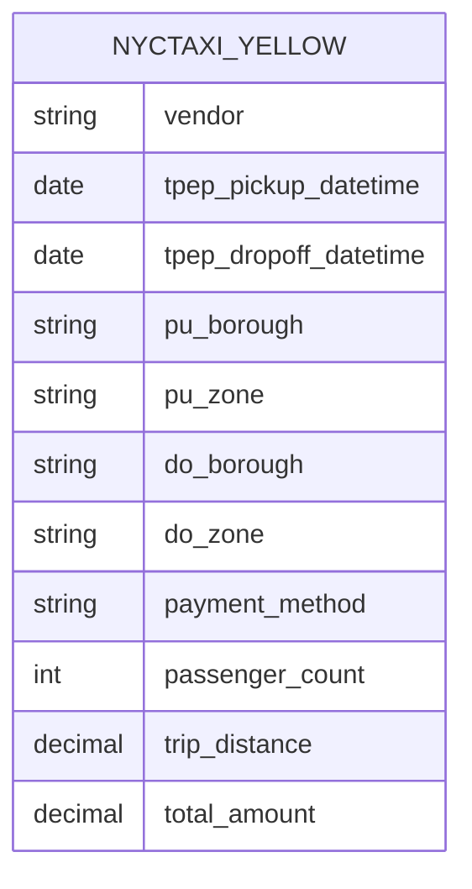

# Semantic Model — `nyctaxi_yellow`

The semantic model is the governed business layer between `ProjectWarehouse` and Power BI. It centralizes measures, formatting, and business-friendly naming so that all reporting shares a single source of truth.

> **Note on workspace topology:** the primary `ProjectWarehouse` is loaded by pipelines in the data workspace. Because Fabric's My workspace (trial) restricts semantic model publishing, the model was built in a dedicated reporting workspace against a **snapshot copy** of the warehouse. The modeling approach is identical to binding directly against the primary warehouse; the trade-off is that new pipeline runs require re-syncing the snapshot before they appear in the report.

The sync is handled by a small pipeline in the reporting workspace, `pl_sync_reporting_warehouse`: a script activity clears the snapshot tables, then a Fabric **Copy job** performs a full copy of the presentation table and zone lookup from the primary warehouse. The delete-then-load sequencing makes the sync idempotent — the same idiom the staging pipeline uses — so a re-run can never duplicate data. (The copy job writes in append mode; running it without the clearing step would stack copies, which is exactly what the wrapper pipeline prevents.) Replacing the snapshot with a direct binding (or deployment-pipeline promotion between workspaces) is on the [roadmap](../README.md#roadmap).

---

## Model Design: Single Analytics-Ready Table

The model consists of **one denormalized table** — `nyctaxi_yellow` — sourced from `ProjectWarehouse` (`dbo.nyctaxi_yellow`).

### Why a single-table model?

This is a deliberate design choice, not an omission:

| Consideration | Rationale |
|---|---|
| **Lookups resolved upstream** | The T-SQL transformation maps vendor and payment-type codes and joins taxi-zone reference data *during processing*, so descriptive attributes (vendor name, borough, payment method) arrive as ready-to-use columns — no runtime relationship traversal needed |
| **Single fact grain** | The model answers questions about one entity (trips) at one grain (one row per trip). With no second fact table to conform dimensions across, a star schema adds structure without adding capability |
| **Simplicity for self-service** | Analysts see one table with clearly named fields — no risk of broken filter paths or ambiguous relationships |
| **Trade-off acknowledged** | The cost is reduced reusability: if a second fact table (e.g., green taxi trips) were added, shared dimensions would become the better design. See [Roadmap](../README.md#roadmap) |

---

## Measures (DAX)

The model defines **3 measures** centralizing the business logic used across the report:

| Measure | Definition | Used in |
|---|---|---|
| **Total Revenue ($)** | `SUM ( nyctaxi_yellow[total_amount] )` | Revenue KPI, daily revenue chart |
| **Number of Trips** | `COUNTROWS ( nyctaxi_yellow )` | Trip volume KPI, borough journeys table |
| **Number of Passengers** | `SUM ( nyctaxi_yellow[passenger_count] )` | Passenger KPI |

Measures are defined once in the model — never re-created per visual — so definitions stay consistent across every report page.

Date filtering and trend analysis use `tpep_pickup_datetime` directly — the column is already date-typed by the upstream transformation, so no derived date column is needed in the model.

---

## Modeling Decisions

| Decision | Rationale |
|---|---|
| **Denormalize in the pipeline, not the model** | Transformation logic lives in one governed place (the `dbo.process_presentation` stored procedure) rather than being re-implemented in DAX |
| **Measures over calculated columns** | Computed at query time against compressed data; keeps model size down |
| **Business-friendly names** | Analysts see "Payment Method," not source-system codes — enabling true self-service |

---

## Consumption

The model serves the **NYC Yellow Taxi Report** (Power BI), covering revenue, trip volume, passenger trends, vendor performance, payment behavior, and time/location demand patterns. See the main [README](../README.md#semantic-model--dashboard) for the business questions each page answers.
