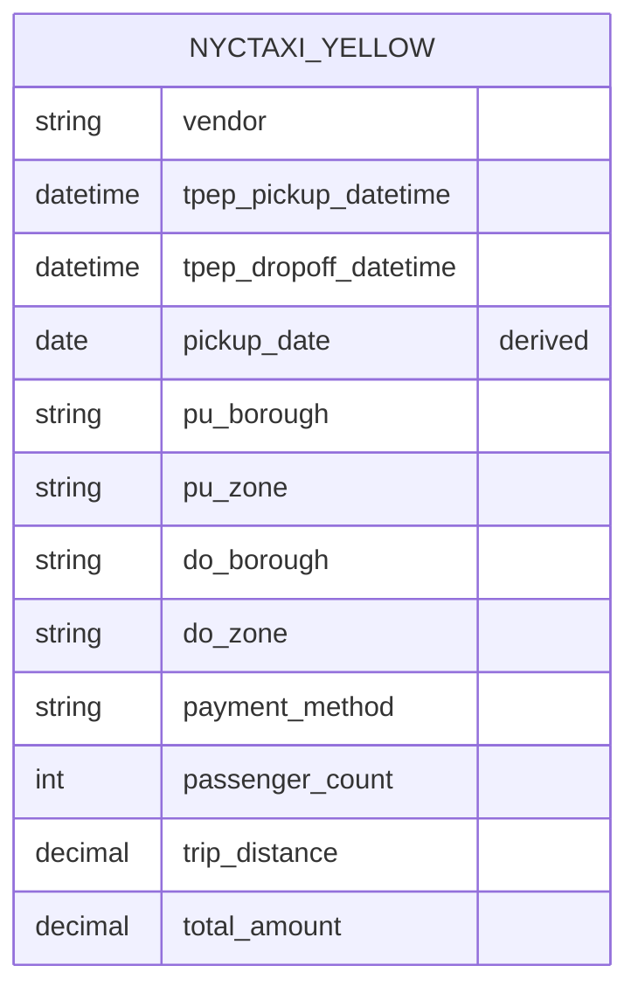

# Semantic Model — `nyctaxi_yellow`

The semantic model is the governed business layer between `ProjectWarehouse` and Power BI. It centralizes measures, formatting, and business-friendly naming so that all reporting shares a single source of truth.

> **Note:** published through Power BI due to Fabric Trial capacity limitations. The modeling approach is identical to a Fabric-native semantic model deployment.

---

## Model Design: Single Analytics-Ready Table

The model consists of **one denormalized table** — `nyctaxi_yellow` — sourced from `ProjectWarehouse` (`dbo.nyctaxi_yellow`).

### Why a single-table model?

This is a deliberate design choice, not an omission:

| Consideration | Rationale |
|---|---|
| **Lookups resolved upstream** | Dataflow Gen2 joins vendor, payment-type, and taxi-zone reference data *during transformation*, so descriptive attributes (vendor name, borough, payment method) arrive as ready-to-use columns — no runtime relationship traversal needed |
| **Single fact grain** | The model answers questions about one entity (trips) at one grain (one row per trip). With no second fact table to conform dimensions across, a star schema adds structure without adding capability |
| **Simplicity for self-service** | Analysts see one table with clearly named fields — no risk of broken filter paths or ambiguous relationships |
| **Trade-off acknowledged** | The cost is reduced reusability: if a second fact table (e.g., green taxi trips) were added, shared dimensions would become the better design. See [Roadmap](../README.md#roadmap) |

---

## Measures (DAX)

The model defines **4 measures** centralizing the business logic used across the report:

| Measure | Definition | Used in |
|---|---|---|
| **Total Revenue** | `SUM(nyctaxi_yellow[total_amount])` | Revenue KPIs, vendor analysis |
| **Total Trips** | `COUNTROWS(nyctaxi_yellow)` | Trip volume KPIs |
| **Total Passengers** | `SUM(nyctaxi_yellow[passenger_count])` | Passenger KPIs |
| **Avg Revenue per Trip** | `DIVIDE([Total Revenue], [Total Trips])` | Vendor & payment analysis |

<!-- TODO: verify these four names/definitions against the Measures node in Model view and adjust if they differ -->

Measures are defined once in the model — never re-created per visual — so definitions stay consistent across every report page.

The model also includes a derived **Pickup Date** field supporting daily and monthly trend analysis.

---

## Modeling Decisions

| Decision | Rationale |
|---|---|
| **Denormalize in the pipeline, not the model** | Transformation logic lives in one governed place (Dataflow Gen2) rather than being re-implemented in DAX |
| **Measures over calculated columns** | Computed at query time against compressed data; keeps model size down |
| **Business-friendly names** | Analysts see "Payment Method," not source-system codes — enabling true self-service |

---

## Consumption

The model serves the **NYC Yellow Taxi Report** (Power BI), covering revenue, trip volume, passenger trends, vendor performance, payment behavior, and time/location demand patterns. See the main [README](../README.md#semantic-model--dashboard) for the business questions each page answers.
